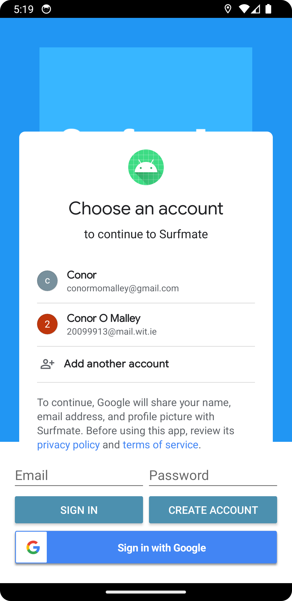

# Mobile App Development - Assignment 2

# SurfmateV2

__Name:__ Conor O'Malley

## Description

Surfmate is an Android application built using Android Studio. Users can add, edit, delete and view surf spots. The user can also map their surfing locations.

The main technologies used:
+ Android Studio
+ Kotlin
+ Firebase (User Authentication, Realtime Database & Storage)
+ Google Auth & Maps
+ Git & Github

## Features

+ Full CRUD functionality for surf spots
+ User signup and login via Google Auth and/or Firebase Auth
+ Surf spot and user persistance via Firebase Auth (Users) & Firebase Realtime Database (Surf spots)
+ Splash screen
+ Google Map functionality for individual spots aswell as an all spots view
+ Surf spot information: name, observations, add image, location & rating
+ User can add image via gallery
+ User profile pic storage via Firebae Storage
+ Navigation Bar
+ Swipe functionalty for Editing, Deleting & Refreshing
+ Search/Filter toolbar

## Design
> Splash Screen

> Signup/Login

> Surf Spots List

> Navigation Bar

> Swipe Edit/Delete/Refresh

> Map View

## UML Diagram

## UX/DX Approach

### UX

The main UX feature is the use of a vertical navigation drawer. This makes navigating around the application for the user easy and intuitive. The aim of the design was to be clean and simple and easy to read on a mobile device of any size. All features are easily identifiable by using descriptive text and/or icons to distinguish their intended use.

### DX

I implemented an MVVM(Model-View-ViewModel) Design pattern. This pattern improves scaling and reusability by separating the applications business logic from the GUI.

## Git Approach Adopted

I decided to implement a 'feature branch' approach. Features that i felt were more substantial were developed in their own branch which was then merged into the main branch when ready. Feature branches used for this project were: Firebase, Google Auth & Google Maps. Smaller features were built in local 'main' and pushed to remote repo 'main' branch when fully tested. The major release would come from the main branch on Github.

## Personal Statement

This has been a very challenging and rewarding project in a lot of ways. Using an MVVM design is something that would bear a lot of fruit in the development of larger projects going forward. Firebase has also proved to be a very versatile tool and i particularly enjoyed this aspect. The next feature i would have liked to incorporate woud be an API for marine data to create a surfing report based on the lat and lng coordinates. This is something i have began to research(see references) but will not implement in this version of Surfmate. Overall I am happy with what i was able to implement for this assignment.

## References

+ https://learntodroid.com/how-to-use-firebase-authentication-in-an-android-app-using-mvvm/
+ https://medium.com/@jecky999/mvvm-architecture-in-android-using-kotlin-a-practical-guide-73f8de1d9c58
+ https://www.geeksforgeeks.org/how-to-create-a-splash-screen-in-android-using-kotlin/
+ https://www.geeksforgeeks.org/ratingbar-in-kotlin/
+ https://www.baeldung.com/kotlin/list-filtering
+ https://stormglass.io/?gad_source=1&gclid=Cj0KCQiAm4WsBhCiARIsAEJIEzXOVbHEG8hKy6SssI7m905aBVlRcb-xQWp2CoCmoGWrCL2TSYAHqfkaAgNvEALw_wcB
+ https://medium.com/@jeremy.leyvraz/kotlin-simplify-your-api-calls-with-elegance-with-retrofit-1be6da7adae4
